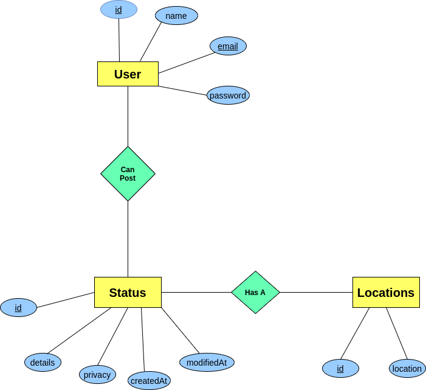

# Social Media
A small social media platform with REST and Basic Security where users can post and update status with location.

[Visit here](https://social-media-angular.herokuapp.com/) for quick demo.

### Functional Requirements
1. Visitor can register/login.
2. Visitor/User can read status.
3. Users can create new status.
4. Users can view status of other users.
5. Status owner can update status.
6. Status owner can change status privacy.

### Technical Requirements
1. System will only show public status to anyone.
2. System should comply with REST architecture.

### ER Diagram

### Technologies
#### Backend
Here I use [Spring Boot (v2.5.2)](https://spring.io/projects/spring-boot) freamework of [Java](https://www.oracle.com/java/).
* [Spring Boot Web](https://spring.io/projects/spring-boot) - Build RESTful web service.
* [Spring Boot Security](https://spring.io/guides/gs/securing-web) - Securing Web.
* [Spring Boot Data JPA](https://spring.io/guides/gs/accessing-data-jpa) - Accessing database.
* [H2](https://www.h2database.com) - Lightweight In-Memory database written in Java.
* [Gradle (v7.0.2)](https://gradle.org) - Gradle is a build automation tool for multi-language software development.
* [IntelliJ Idea](https://www.jetbrains.com/idea) - Awesome and Powerful IDE for Java!
#### Frontend
* [Angular (v12.1.1)](https://angular.io) - TypeScript-based open-source web application framework.
* [Node (v14.5.4)](https://nodejs.org) - JavaScript runtime environment that runs on the V8 engine and executes JavaScript code outside a web browser.
* [Tailwind CSS](https://tailwindcss.com/) - Tailwind CSS is a "utility-first" CSS framework that provides a deep catalog of CSS classes and tools.
* HTML

### Uses
Credentials:

`bashar@gmail.com` `123456`

### Setup
#### Running Local
This project has two application one for frontend (Angular) and another for backend (Spring).
As this project H2 as database and hibernate(JPA) as ORM. So, it **does not require any schema** file 
though there is a **data.sql** in resource for initial data loading. Running project is easy as below,

1. Install Java and Gradle.
2. Run command ``./gradlew bootRun``.
3. Install Node and Angular.
4. Run command ``ng -serve``.

#### Running on Docker
Unlike local setup docker it pretty easy to run.

1. Install Docker & Docker-Compose on machine.
2. Change Angular API Url from environment to backend.
2. Run ``docker-compose up``

#### Running on Heroku
This process it quite tough. But, The Dockerfile & heroku.yml of this repository perfectly handle those issue.

1. Create a pipeline of this repository.
2. Create two different application of **container** stack inside that pipeline.
3. Deploy from the both branch angular and spring in according to application.

Hurrah!! you make it run!

## License 
Distributed under the [MIT](https://opensource.org/licenses/MIT) License. See **LICENSE** for more information.

## Contact 

Abul Basar - [@basharkhan6](https://facebook.com/basharkhan6) - basharkhan6@gmail.com

Git Link: [https://github.com/basharkhan6/Social_Media](https://github.com/basharkhan6/Social_Media)

Project Link: [https://social-media-angular.herokuapp.com](https://social-media-angular.herokuapp.com)

